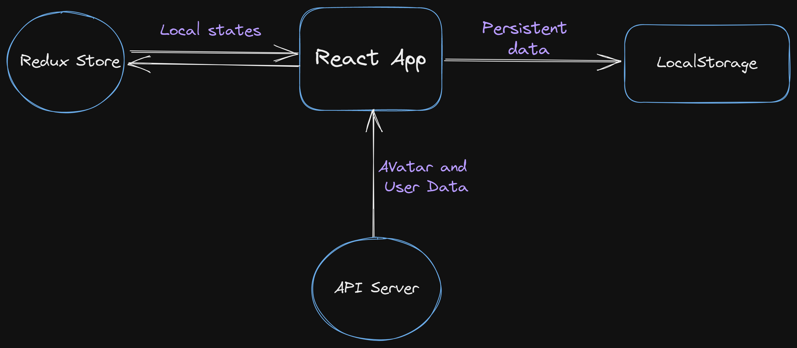

# Trendydice Assignment

-> This application uses `react-redux` and `redux-toolkit` to store user states `ant design` for UI.

---

## Features

-> Data will be persistent and API call will be made only after each 60 minutes.

-> User can `update and delete` user cards also mark any card as favorite.

---

## Flow chart

